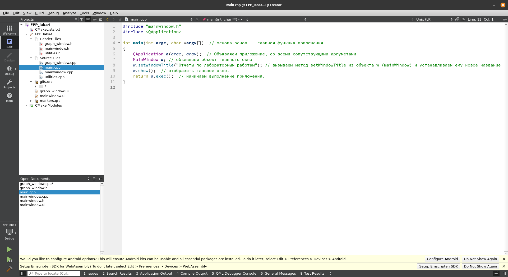
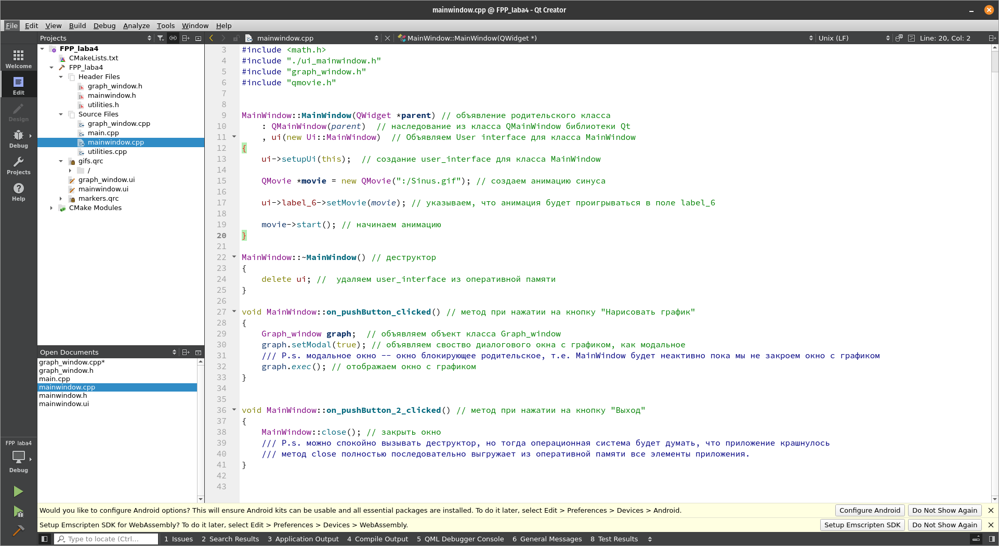
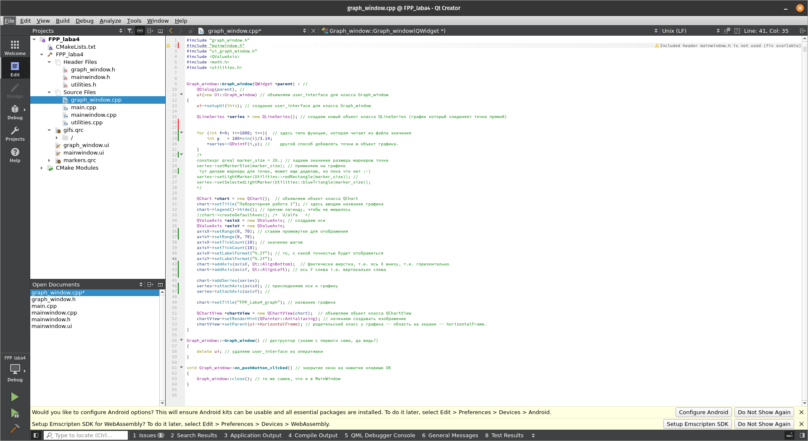
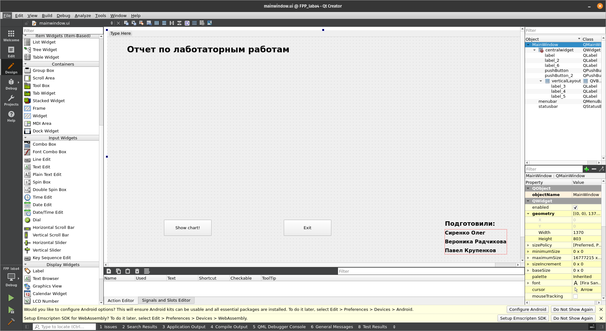
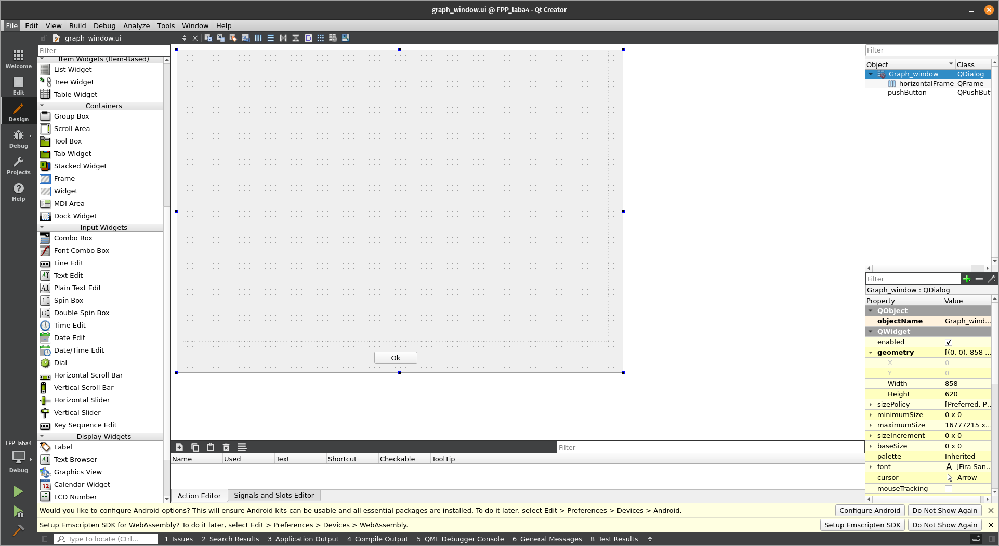
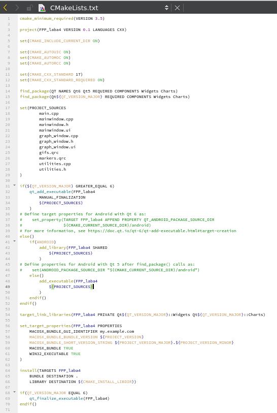
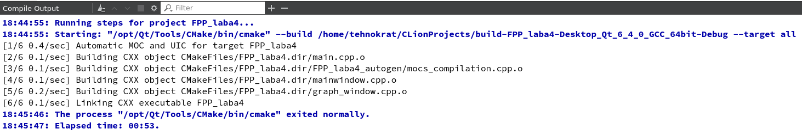
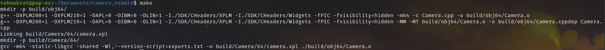

#  Руководство для моих физических коллег
## Структура приложения:
+ [main.cpp](main.cpp)
    - [MainWindow.cpp](./Main_Window.cpp)
    - [MainWindow.h](MainWindow.cpp)
        - [Graphic_window.cpp](Graphic_window.cpp)
        - [Graphic_window.h](Graphic_window.h)
  
### Описание для каждого файла
[main.cpp](main.cpp) – главный файл приложения. Соответственно, в файле _**main.cpp**_  лежит только функция **main**, которая принимает argc и argv. В свою очередь **_argc_**  –   аргумент, который показывает количество параметров, _**argv**_ – сами параметры. Далее функция вызывает метод show класса mainwindow. 

[MainWindow.cpp](./MainWindow.cpp) – файл, где подгружаются методы и user_interface MainWindow. Далее при нажатии на кнопку _"показать график"_ вызывается **_exec_** метод класса Graphic_window. 

[Graphic_window](Graphic_window.cpp) – файл, где происходит (или будет происходить вся магия (Пока что не происходит)).  Тут должна читаться инфа с лаб. И рисоваться график.

## Прочитайте комменты, я заколебался их писать
Там вообще есть все указания. И если нужно пишите мне в вк или телеграм (@tehnokratgod).

# Среда разработки

### Ремарка для Николая Николаевича Кольчевского
   Т.к. основной разработчик Олег Сиренко, который очень любит Linux (не самое лучшее качество человека) и ему это требуется по работе, то вся разработка и компиляция происходит на операционной системе Linux [Pop_Os!](https://pop.system76.com/).  
   
   
   
   
   
   
   
   
   
   
   
   
## Почему Qt Creator?
Qt Creator дает возможность быстро и эффективно создать настольное приложение на языке C++.
## Cкриншоты

### Текстовый редактор

### Редактор окон

## Скриншоты компиляции

### cmakefile
Почитать о cmake можно [здесь](https://habr.com/ru/post/155397/).
Как он выглядит в нашем проекте можно увидеть на следующем скрине.

## Компиляция в среде разработки

### Если бы компиляция была вручную, то она выглядела примерно так:

Да! Все так просто! Потому что в линуксе уже есть утилита для сборки проектов из терминала. Почитать про это можно [здесь](https://habr.com/ru/post/155201/) и [здесь](https://habr.com/ru/post/211751/). 