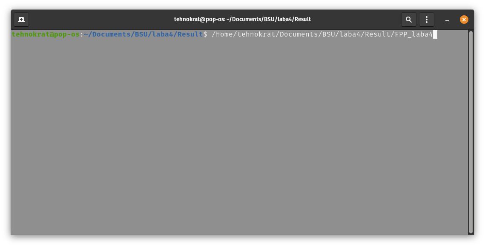
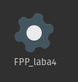

#  Руководство
## Структура приложения:
+ [main.cpp](main.cpp)
    - [MainWindow.cpp](./Main_Window.cpp)
    - [MainWindow.h](MainWindow.cpp)
        - [Graphic_window.cpp](Graphic_window.cpp)
        - [Graphic_window.h](Graphic_window.h)
  
### Описание для каждого файла
[main.cpp](main.cpp) – главный файл приложения. Соответственно, в файле _**main.cpp**_  лежит только функция **main**, которая принимает argc и argv. В свою очередь **_argc_**  –   аргумент, который показывает количество параметров, _**argv**_ – сами параметры. Далее функция вызывает метод show класса mainwindow. 

[MainWindow.cpp](./MainWindow.cpp) – файл, где подгружаются методы и user_interface MainWindow. Далее при нажатии на кнопку _"показать график"_ вызывается **_exec_** метод класса Graphic_window. 

[Graphic_window](Graphic_window.cpp) – файл, где происходит вся магия.  Тут читается инфа с лаб и рисуется график.

# Среда разработки

## Ремарка для Николая Николаевича Кольчевского
   Т.к. основной разработчик Олег Сиренко, который очень любит Linux (не самое лучшее качество человека) и ему это требуется по работе, то вся разработка и компиляция происходит на операционной системе Linux [Pop_Os!](https://pop.system76.com/).  
   
##  Qt Creator 

Qt Creator - это кроссплатформенная интегрированная среда разработки (IDE), созданная для максимального удобства разработчиков. Qt Creator работает в настольных операционных системах Windows, Linux и Mac OS и позволяет разработчикам создавать программное обеспечение на настольных, мобильных и встраиваемых платформах.
[Скачать Qt Creator](https://www.qt.io/product/development-tools).

### Версия Qt Creator – 8.0.1

#### Установка Qt Creator

Для установки среды разработки «QtCreator» необходимо скачать установочный файл с официального сайта QT (https://www.qt.io/download). На главной странице сайта выбрать меню «Go open source». 

На следующей странице выбрать меню «Download the Qt Online Installer»

Скачивание начнется после нажатия на кнопку «Download». После окончания скачивания в папке для загрузок будет расположен файл: «qt-unified-linux-x64-4.2.0-online.run». Необходимо открыть его.

После запуска файла «qt-unified-linux-x64-4.2.0-online.run» начнется установка «QtCreator».

Установите «QtCreator» согласно командам установщика. (Для установки необходим аккаунт на официальном сайте qt.io) . Также на момент 2022 года необходимо использовать VPN для авторизации в приложении установки Qt Creator.

После установки «QtCreator» в меню запуска приложений появится приложение QtCreator. Запустите его. (Для корректной компиляции программного обеспечения необходимо проверить установку (в случае отсутствия - установить) компилятора gcc, g++ и дополнительного ПО).

### Принцип работы

#### Компиляция и установка приложения

#### Запуск

Или двойной клик по иконке приложения

#### Скриншоты из приложения

##### Главное окно встречающее пользователя

##### При нажатии на кнопку показать графики

При нажатии на кнопку "Показать графики" появляется диалоговое окно с выбором лабораторной работы и таблицы.

##### После выбора и нажатия на кнопку " Ок"

 При нажатии на кнопку Ok открывается график.

   
   
##### При нажатии на кнопку "сохранить"

   Появляется сообщение, что график сохранен.
   (Тут используется скриншот из более новой версии приложения, единственные отличия – добавлены логотип и название команды).
   
   
   
## Скриншоты кода
Все файлы можно найти на [github](https://github.com/OlegSirenko/Physics-of-semiconductors-and-semiconductor-devices).

####  Main.cpp
   
   
#### MainWindow.cpp

   Далее из main.cpp вызывается mainwindow.cpp
   
   
#### Graph_Window.cpp
   Далее из mainwindow.cpp вызывается graph_window.cpp:
        
   
### Алгоритм
 Программа начинаем выполняться с файла main.cpp. В файле  main.cpp вызывается объект класса Main_Window и начинает свое выполнение. В MainWindow создается несколько хендлеров (ловцов событий на нажатие кнопок). 
 При нажатии на кнопку "Показать графики" создается объект класса Graph_Window.   После запуска скрипта GraphWindow Запускается "подокно" (диалоговое окно с выбором графика). После выбора варианты, данные загружаются из файла и на их основе строится график, далее запускается окно в котором видно график и кнопки управления –  "Ok" и "Сохранить график". 
 
 
### Проект 
Проект можно скачать с [github](https://github.com/OlegSirenko/Physics-of-semiconductors-and-semiconductor-devices).

### Исполняемый файл
Исполняемый файл можно скачать с [github](https://github.com/OlegSirenko/Physics-of-semiconductors-and-semiconductor-devices). Стоит учитывать, что испольняемый файл – работает только на операционной системе Linux.
 